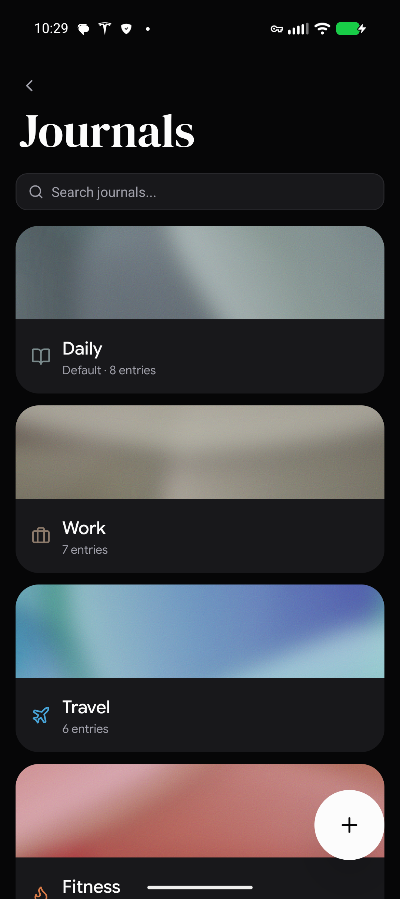
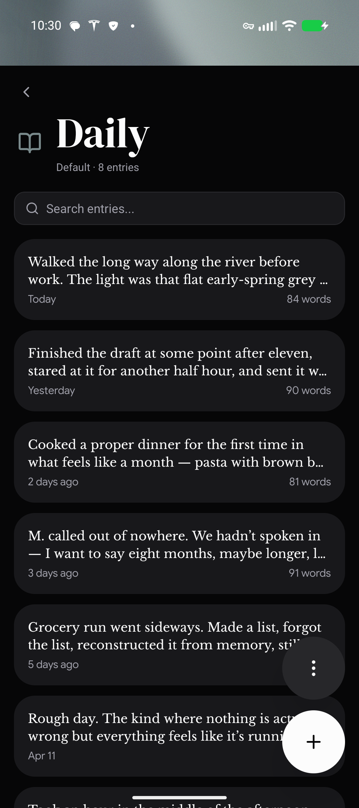
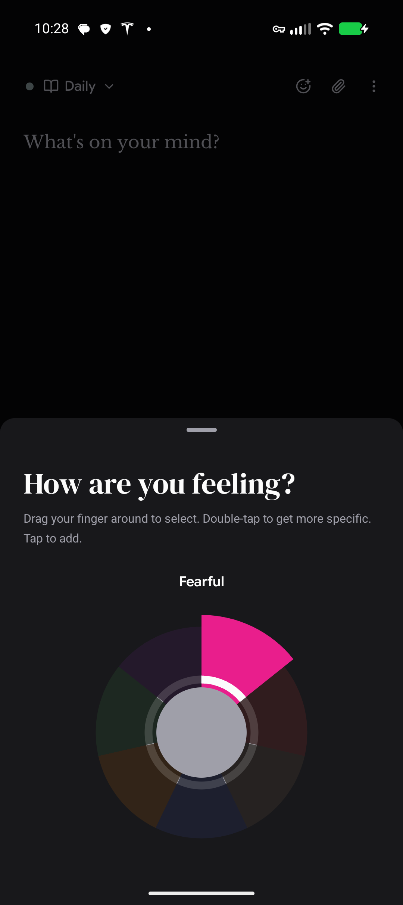
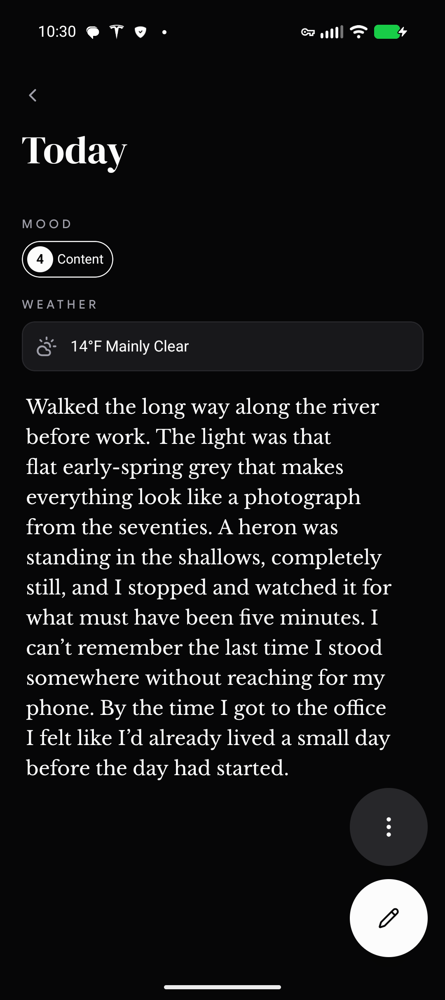

  

# Verso

Your private, local space for self-reflection and growth.

## Features

- Create, customize, and manage journals
- Log mood and location, attach photos, voice notes, documents, and more
- Minimalist distraction-free writing with rich text support
- Dictate entries in realtime with on-device transcription powered by [Whisper](https://github.com/mybigday/whisper.rn)
- Set reminders to help keep up with your practice
- Protect your privacy with app or journal-specific PINs and biometric support.

## Install

Check out the [latest release](https://github.com/carlelieser/verso/releases/latest).

## Screenshots

  
  
  
  

## License

[MIT](LICENSE)